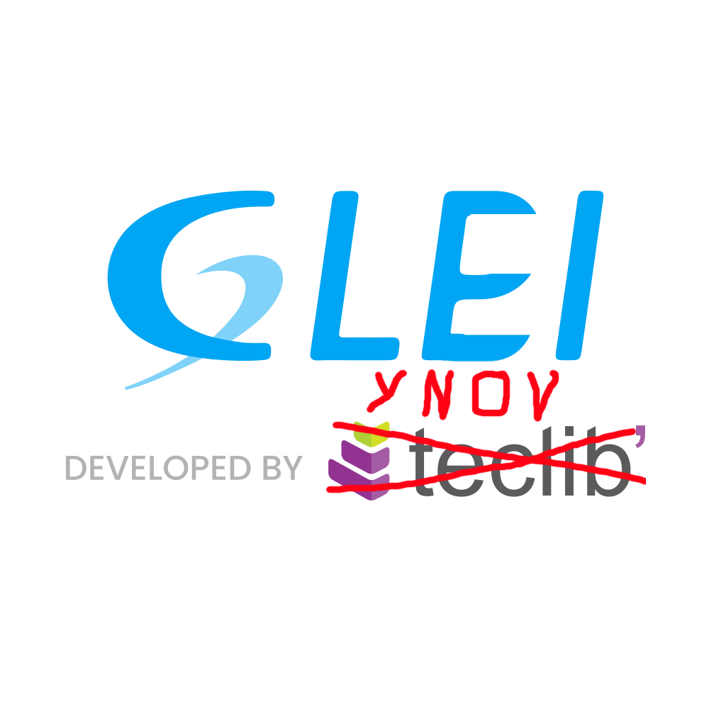

# GLEI

Soit : "Gestionnaire Libre d'Écosystème Informatique"

# Installation (pour developpement seulement):
 - installation de [npm](https://nodejs.org/en/download) avec pnpm
 - installation de [composer](composerInstaller.sh)
 - execution du runner [runDev](runDev.sh)

# Credit :
### Dev : 
- Elias
- Timothé
- madchip

### Infra :
